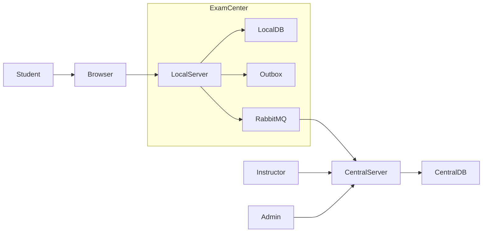
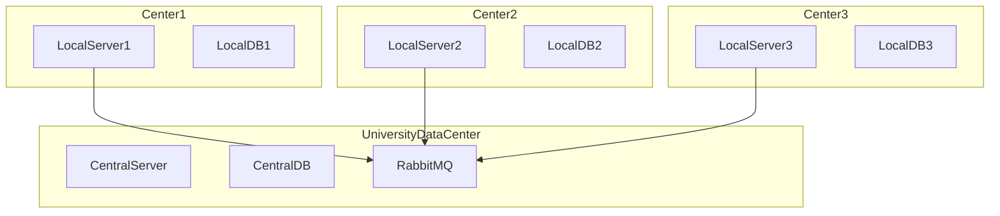
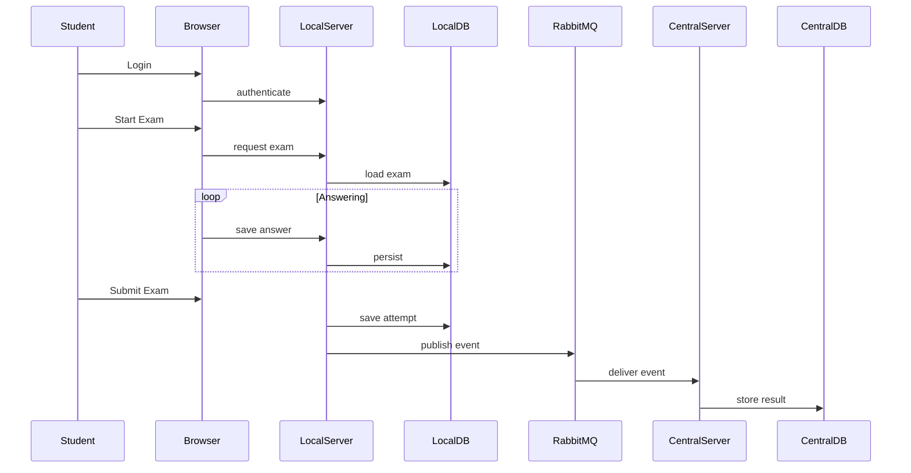
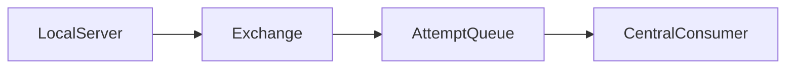
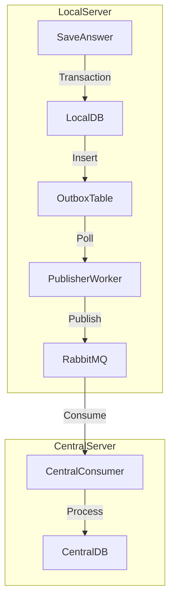

# Distributed Examination System

### Full Architecture & Implementation Plan

Version: 1.0  
Purpose: Technical plan for development team

---

# 1. System Overview

The goal of the system is to provide a **reliable digital exam platform** for universities where exams are conducted in **physical exam centers**.

Because internet connectivity may be unstable, the system follows a **local-first distributed architecture**.

Each exam center contains a **local server** responsible for:

- serving exam UI

- saving answers locally

- managing exam sessions

- synchronizing results to the central server.

---

# 2. System Goals

Primary goals:

- reliable exam execution

- zero answer loss

- scalable architecture

- support offline operation

- centralized reporting

---

# 3. Non Functional Requirements

| Requirement        | Target                   |
| ------------------ | ------------------------ |
| Reliability        | No data loss             |
| Scalability        | 3000 students per center |
| Latency            | <100ms                   |
| Security           | Strong authentication    |
| Offline capability | Required                 |

---

# 4. High Level Architecture



Key idea:

Students only interact with **LocalServer**.

---

# 5. Deployment Architecture



---

# 6. Bounded Contexts (DDD & ABP Architecture)

The system is split into two distinct Bounded Contexts to decouple management complexity from execution reliability.

| Feature | **Central Server (ExamManagement)** | **Local Server (ExamExecution)** |
| :--- | :--- | :--- |
| **Role** | Authoring & Grading | Delivery & Reliability |
| **Primary Aggregate** | `Exam` (Complex Rules) | `ExamSession` (State Machine) |
| **Secondary Aggregate** | `QuestionBank` | `DeliveredExam` (Read-Only) |
| **Database** | PostgreSQL | PostgreSQL |

### Shared Kernel
- **Contracts:** `ExamPackageDto`, `ExamResultDto`
- **Enums:** `ExamType`, `QuestionType`
- **Role:** Defines the language spoken between the two contexts.

---

# 7. Data Synchronization Strategy

We use a **"Notify-then-Download"** pattern to handle large exam files efficiently.

### Direction: Central -> Local (Exam Distribution)
1.  **Publish:** Central Server publishes a lightweight `ExamPublishedEto` event via RabbitMQ.
2.  **Notify:** Local Server receives the event and validates the checksum.
3.  **Download (Hybrid Strategy):**
    *   **Data (JSON/Structure):** Uses **ABP Dynamic C# API Client Proxies** (`IExamAppService`).
        *   *Mechanism:* The Local Server injects `IExamAppService` (which is a remote proxy). It calls `await _examAppService.GetAsync(id)`.
        *   *Why:*
            *   **Type Safety:** No need to manually parse JSON. If the DTO changes on the server, the client build fails (compile-time safety).
            *   **Auth & Headers:** ABP automatically attaches the JWT token and Correlation ID to the request.
            *   **Reference:** [ABP Framework: Dynamic C# API Clients](https://docs.abp.io/en/abp/latest/API/Dynamic-CSharp-API-Clients)
    *   **Assets (Large Media):** Uses **`IHttpClientFactory`** with `Polly` policies.
        *   *Mechanism:* For large files (images, zip containers), we use `IHttpClientFactory` to create a client, then use `GetStreamAsync()` to pipe the response directly to a `FileStream` on disk.
        *   *Why:*
            *   **Memory Efficiency:** ABP Proxies load the entire response into RAM (JSON deserialization). For a 500MB video file, this would crash the Local Server. `GetStreamAsync` uses a constant small buffer (e.g., 8KB).
            *   **Socket Management:** `IHttpClientFactory` manages the underlying `HttpMessageHandler` lifetimes, preventing "Socket Exhaustion" (running out of ports) and DNS staleness.
            *   **Resilience:** We wrap this in a `Polly` retry policy (e.g., "Retry 3 times with exponential backoff") to handle transient network blips.
            *   **Reference:** [Microsoft Docs: Use IHttpClientFactory to implement resilient HTTP requests](https://learn.microsoft.com/en-us/dotnet/architecture/microservices/implement-resilient-applications/use-httpclientfactory-to-implement-resilient-http-requests) [ABP Application service working with Streams](https://abp.io/docs/4.3/Application-Services#working-with-streams)
4.  **Ingest:** Local Server saves the package to **Blob Storage** (FileSystem) and imports metadata to db.

### Direction: Local -> Central (Results)
1.  **Submit:** Student submits exam; `ExamSession` is marked completed.
2.  **Queue:** Results are saved to the **Outbox** table immediately (Zero Data Loss).
3.  **Push:** Background worker pushes `ExamSubmittedEto` (containing answers) to RabbitMQ when online.

### Exam Updates (Versioning Strategy)
What happens if an exam is modified after publishing?
1.  **Central:** Instructor updates the exam. System increments `DataVersion` (v1 -> v2) and republishes the event.
2.  **Sync:** Local Server receives `ExamPublishedEto` (v2). It downloads the new package.
3.  **Local State:**
    *   **v1 (Old):** Marked as `Deprecated`. Existing active sessions continue using v1 to avoid disruption.
    *   **v2 (New):** Marked as `Active`. Any new student logins will receive v2.
    *   **Result:** All results map to `ExamInstanceId` + `DataVersion` so grading knows which version was taken.

---

# 8. Technology Stack

*   **Framework:** ABP Framework 
*   **Communication:**
    *   **Events:** `Volo.Abp.EventBus.Distributed` (RabbitMQ)
    *   **Data Sync:** **ABP Dynamic C# API Client** (for structured data) + **`IHttpClientFactory`** (for binary streams).
*   **Storage:**
    *   **Files:** `Volo.Abp.BlobStoring` (Central: S3/MinIO, Local: FileSystem)
    *   **Data:** EF Core with PostgreSQL (Both Central and Local)
*   **Reliability:** ABP Inbox/Outbox pattern enabled.

# 9. Domain Models
> **Note:** For the complete attribute list, invariants, and entity relationships, please refer to **[Domain_Definition.md](./Domain_Definition.md)**.

## 9.1 Shared Kernel (`MyProject.Domain.Shared`)
- **Enums:** `ExamType`, `QuestionType`, `ExamStatus`.
- **DTOs:** `ExamPackageDto` (JSON Blob), `ExamResultDto`.

## 9.2 Central Server (`ExamManagement`)
*   **`ExamDefinition`:** The master blueprint (Title, Duration, Rules).
*   **`ExamInstance`:** The immutable version (Snapshot of questions).
*   **`ExamCenter`:** Physical venue with Capacity and Identity (`LinkedClientId`).
*   **`ExamSchedule`:** Logistics linking Instance + Center + Time + Students.
*   **`QuestionPool`:** Bank of reusable questions.
*   **`ExamResult`:** Grading, Status, and Appeals (`ExamReview`).

## 9.3 Local Server (`ExamExecution`)
*   **`DeliveredExam`:** Read-Only cached exam package.
*   **`ExamSession`:** The student's attempt (State Machine: Started -> Submitted). Enforces **Single Session** and **Grace Period**.
*   **`ExamCenterSession`:** Room management (Unlock Codes).
*   **`SyncRecord`:** Tracks synchronization status (Pending/Synced) and retries.

---

# 10. Detailed Functional Requirements

## 10.1 Authoring & Versioning (Central)
- **Question Bank:** Instructors create reusable questions organized by subject/pool.
- **Hybrid Exam Assembly:**
  - **Master Exam (Definition):** Defines rules (e.g., "Pick 10 Qs from Algebra Pool").
  - **Exam Instance (Version):** System automatically generates unique versions based on rules for different time slots/groups.
  - **Goal:** Different groups get different questions to prevent answer leaking.

## 10.2 Scheduling & Security (Central -> Local)
- **Strict Scheduling:** Assign Exam + Student Group + Center + Time Window.
- **Access Control:**
  - Student can only take the exam at their assigned center and time.
  - **Dynamic Room Code:** The Local Server generates a unique code for each session. The Room Supervisor verbally gives this code to students to unlock the exam.
  - **Identity Verification:** Local Server validates Student ID against the allowed list for that session.

## 10.3 Execution & Reliability (Local)
- **Offline Delivery:** Exams are downloaded beforehand; students take the exam on local LAN.
- **Server-Side Timer & Grace Period:**
  - **Mechanism:** `EndTime = StartTime + Duration` (Server Time).
  - **Frontend:** Syncs with Server Time on load. Calculates `TimeRemaining` based on Server Offset, not local clock.
  - **Grace Period Policy:**
      - **Strict Deadline:** The system *must* receive the submission by `EndTime`.
      - **Latency Buffer:** A fixed **30-second grace period** is allowed for network latency.
      - **Rule:**
          - `SubmissionTime <= EndTime + 30s` -> **Accepted**.
          - `SubmissionTime > EndTime + 30s` -> **Rejected (Marked as Timed Out)**.
      - **Client Behavior:**
          - At `EndTime`, the client auto-submits.
          - If the Local LAN is down at that exact moment:
              - Client shows "Reconnecting..."
              - Client *retries* submission until successful.
              - **Server Validation:** The Server accepts late submissions *only if* the client includes a cryptographic timestamp signed by the last valid heartbeat (complex) OR we rely on the Supervisor to manually override in extreme network failure cases.
              - *Decision:* For V1, we stick to the **Hard Deadline + 30s**. If LAN fails, Supervisor uses "Resume Session" (10.5) to extend time.
- **Flexible Navigation:** Students can skip, flag, and change answers within the time limit.
- **Zero Data Loss:** Answers are saved locally immediately; synced to Central when online.

## 10.4 Grading & Reporting (Central)
- **Architecture:** Uses the **Strategy Pattern** to support pluggable grading logic.
    - **`IGradingStrategy` Interface:** Defines `CalculateScore(Question q, Answer a)`.
    - **Implementations:**
        - `StandardGradingStrategy`: Simple Match (1 or 0). **(Default for V1)**.
        - `NegativeMarkingStrategy`: Wrong answer deducts points.
        - `PartialCreditStrategy`: Multiple Select Questions get partial points.
- **Workflow:**
    1.  Submission received (Queue).
    2.  `GradingService` loads the exam's assigned strategy.
    3.  Scores calculated -> Status updates to `Graded`.
    4.  Instructors manually grade Essay questions.
- **Result Workflow:** Results go through `Pending Grading` -> `Graded` -> `Published`.

---

## 10.5 Proctoring & Incident Recovery (Local)
- **Proctor Dashboard:** Real-time view for the Room Supervisor showing:
  - Student Status (Online/Offline/Submitted).
  - Progress (e.g., "Answered 15/50 questions").
  - Warnings (e.g., "Connection lost for > 2 mins").
- **Incident Recovery (PC Crash Protocol):**
  - If a student's PC fails, the Supervisor can authorize a "Session Resume" on a new device.
  - **Mechanism:** Student logs in on new PC -> Suptervisor approves "Resume" -> System pulls last saved state from Local DB -> Student continues with remaining time.

---

## 10.6 Anti-Cheating & Security
- **Dynamic Unlock Code:** Code changes per session.
- **Strict Access:** Student must be in the correct Center + Group + Time.
- **Single Active Session:** The system enforces strictly one active `ExamSession` per Student.
    - *Mechanism:* `StartExam()` checks if an active session exists.
    - *Prevention:* If a session is `In Progress`, login from a second device is blocked.
    - *Exception:* "Resume Session" (see 10.5) allows moving to a new device under Supervisor approval.
- **Incident Recovery:** Formal protocol to move student to new PC.

## 10.7 Post-Exam: Reviews & Appeals (Central)
- **Requirement:** Allow students to contest their grade or report issues (e.g., "Question 5 was ambiguous").
- **Aggregate:** `ExamReview`
    - `StudentId`, `ExamResultId`
    - `Reason` (Text)
    - `Status` (Pending, Approved, Rejected)
    - `InstructorResponse` (Text)
- **Workflow:**
    1.  Student views result -> Clicks "Request Review".
    2.  Instructor sees "Pending Reviews" dashboard.
    3.  Instructor decision:
        - **Reject:** Closes ticket.
        - **Approve:** Manually adjusts score in `ExamResult`.
    4.  Student notified of outcome.


---

# 11. Exam Execution Flow



---

# 12. Messaging Architecture

RabbitMQ used for communication.

Events:

- ExamAttemptStarted

- AnswerSaved

- ExamAttemptSubmitted



---

# 13. Outbox Pattern (Guaranteed Delivery)

We leverage **Volo.Abp.EventBus.Distributed** with the **Outbox Pattern** to ensure **Zero Data Loss** even during network failures.

## 13.1 The Mechanism
1.  **Atomic Transaction:** When a student submits an exam, the Local Server performs two actions in a single database transaction:
    *   **Action A:** Update `ExamSession.Status` to `Submitted`.
    *   **Action B:** Insert `ExamSubmittedEto` event into the `AbpDistributedEvents` table (Outbox).
2.  **Commit:** If either fails, the entire transaction rolls back. The data is never "half-saved".
3.  **Publisher Worker:** A background thread (part of ABP) polls the `AbpDistributedEvents` table.
    *   It picks up pending events.
    *   It pushes them to **RabbitMQ**.
    *   **On Success:** It deletes the record from the Outbox.
    *   **On Failure (No Internet/RabbitMQ Down):** It leaves the record and retries later (Exponential Backoff).

## 13.2 Benefits
*   **Resilience:** The exam center can operate completely offline. Results will automatically sync when connectivity is restored.
*   **Throttling:** Prevents the Central Server from being overwhelmed by 500 concurrent HTTP requests. RabbitMQ buffers the load.



---

## 13.3 Sync Granularity
*   **Strategy:** Send **Full Exam Result** upon submission (One Message per Student).
*   **Why Batch?**
    *   **Atomicity:** The Central Grading Engine needs all answers to calculate the final score correctly. Partial updates risk race conditions.
    *   **Efficiency:** A 100-question exam result is ~50KB JSON. RabbitMQ handles this easily. It is far more efficient than sending 25,000 tiny messages (50 questions * 500 students).
    *   **Simplicity:** The transaction is "All or Nothing". If the message arrives, the exam is graded. If not, the Outbox retries until it does.

# 14. Security Architecture

## 14.1 Server-to-Server Authentication (Local <-> Central)
We use **OAuth 2.0 Client Credentials Flow** for secure machine-to-machine communication.

*   **Identity Provider:** Central Server (via OpenIddict).
*   **Client:** Each Local Server is a registered "Client".
    *   **ClientId:** Unique identifier (e.g., `ExamCenter_NY_01`).
    *   **ClientSecret:** Strong random string generated during center provisioning.

### Automated Provisioning (Central Dashboard)
Admin creates an Exam Center via the Dashboard:
1.  **Create:** Admin enters Name ("Lab A") and Capacity.
2.  **Generate:** System calls `IAbpApplicationManager` (Volo.Abp.OpenIddict) to create a Client App.
    *   Generates `ClientId` and `ClientSecret`.
    *   Grants `client_credentials` flow.
3.  **Link:** System saves `ExamCenter` entity with `LinkedClientId`.
4.  **Display:** System shows `ClientSecret` to Admin **(One-time view)**.
5.  **Rotation:** If forgotten, Admin clicks "Reset Credentials". System generates a new Secret and invalidates the old one.

*   **Mechanism (Local Side):**
    *   Admin updates `appsettings.json` with new credentials.
    *   Local Server requests Access Token from `/connect/token`.
    *   Token is cached and automatically refreshed by ABP's `IdentityModel`.
    *   All Sync API calls include `Authorization: Bearer <Token>`.
    *   **Configuration:** The Local Server's `appsettings.json` defines the Central Server credentials:
        ```json
        "RemoteServices": {
          "Default": {
            "BaseUrl": "https://central-exam-server.com"
          },
          "ExamManagement": {
             "BaseUrl": "https://central-exam-server.com",
             "ClientId": "Center_Cairo_01",
             "ClientSecret": "TopSecretValue...",
             "GrantType": "client_credentials", 
             "Scope": "ExamManagement.Sync"
          }
        }
        ```
    
* we  can make it in code by using IAbpApplicationManager that inherit IOpenIddictApplicationManager and used in seeder

*   **Scopes:** `ExamManagement.Sync` (Restricts access to only sync-related endpoints).

## 14.2 Student Authentication (Local)
*   **Philosophy:** The Local Server is **Stateless** regarding students. It does **not** sync the full `Identity` module (User/Pass) for students. It only trusts the **Token**.
*   **Mechanism:** Centralized Authentication with Offline Validation (JWT).
*   **Flow:**
    1.  **Login:** Student clicks "Login" on Local Server.
    2.  **Redirect:** Redirected to Central Server (OpenIddict) to authenticate (User/Pass/MFA).
    3.  **Token Issue:** Central issues a signed **ID Token (JWT)** containing `sub` (StudentId).
    4.  **Callback:** Browser posts the JWT to Local Server.
    5.  **Offline Validation:**
        *   Local Server has the **Central Public Key** (cached during exam download).
        *   Validates the JWT signature locally using `JwtBearerHandler` (No internet required for this step).
        *   **Authorization:** Checks if `sub` (StudentId) exists in the locally downloaded `ExamRoster`.
        *   **Session:** Creates a lightweight `ExamSession` (Cookie), NOT an `AbpUser`.
*   **Session Locking:** Once logged in, the session is locked to that browser/machine fingerprint.
*   **Requirement:** Internet is required only for the initial login handshake. The rest of the exam is offline.

## 14.3 Center Provisioning (Onboarding)
Who creates the credentials? **The Central Server Admin.**

*   **Mechanism:** Use the `OpenIddictDataSeedContributor` (in `ExamManagement.Domain`) or the **OpenIddict UI** (if using ABP Commercial or a custom Admin UI).
*   **Reference:** [ABP Guide: Synchronous Interservice Communication (Client Credentials)](https://abp.io/docs/latest/guides/synchronous-interservice-communication#create-new-client) [Dynamic C# API Client Proxies authentication](https://abp.io/support/questions/6047/Dynamic-C-API-Client-Proxies-authentication)
*   **Workflow:**
    1.  **Admin Action:** Create a new "Application" (Client) for the center.
        *   `ClientId`: `Center_Cairo_01`
        *   `ClientSecret`: `8f92a3-f01...` (Must be hashed in DB, plain text given to Center)
        *   `Permissions`: `ExamManagement.Sync`
    2.  **Output:** Securely transmit the `ClientId` and `ClientSecret` to the Local Server installer.
    3.  **Local Setup:** Configure `RemoteServices` in `appsettings.json` on the Local Server.

## 14.4 Data Encryption
*   **Sensitive Fields:** `CorrectAnswer` in `Question` table is encrypted at the application level.

---

# 15. Failure Scenarios

*   **Internet lost:** Exam continues locally.
*   **RabbitMQ down:** Events stored in Outbox.
*   **Central server down:** Messages queued.

# 16. Critical Dependencies (Often Overlooked)
1.  **Time Synchronization:**
    *   *Problem:* If Local Server clock is wrong, exam might start too early or late.
    *   *Solution:* Local Server must sync with NTP or Central Server Time on handshake. Exams use `ServerTime` (Local), not `BrowserTime`.
2.  **Browser Compatibility:**
    *   *Constraint:* Exam UI must be tested on standard locked-down browsers (e.g., Safe Exam Browser).
3.  **Asset Pre-Caching:**
    *   *Constraint:* 500 students cannot download the same 100MB video at 9:00 AM.
    *   *Solution:* Assets are pre-downloaded to Local Server disk. Browser loads them from Local LAN (1Gbps), not Internet.

# 17. Performance Estimation
*   **Writes:** 50,000 writes/hour (Local DB handles easily).
*   **Queue:** RabbitMQ handles 500 batch messages in <1 second.

# End of Document
