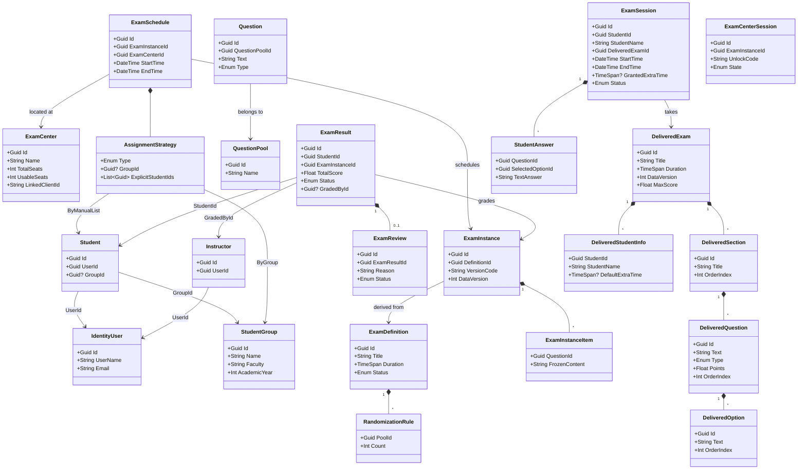

# Domain Definition (DDD Entity Model)

This document serves as the authoritative source for the **Domain Layer**. It defines all Aggregates, Entities, Value Objects, and Invariants for the Distributed Examination System.

---

## 1. Bounded Context: Central Server (`MyProject.ExamManagement`)
**Responsibility:** Authoring, Scheduling, Grading, Integrity, Reporting.

### 1.1 Aggregate: `ExamDefinition` (The Blueprint)
*   **Root Entity:** `ExamDefinition`
    *   `Id`: Guid
    *   `Title`: String (1-256 chars)
    *   `Description`: String?
    *   `Type`: Enum (Quiz, Midterm, Final)
    *   `Duration`: TimeSpan (e.g., 60 mins)
    *   `PassingScore`: Integer
    *   `Status`: Enum (Draft, Published, Archived)
    *   `Sections`: Collection of `ExamSection` (Entity)
        *   `Title`: String (e.g., "Part A: Mathematics")
        *   `OrderIndex`: Int
        *   `Description`: String?
    *   `RandomizationRules`: Collection of `RandomizationRule` (Value Object)
        *   `SectionName`: String (Target Section)
        *   `PoolId`: Guid
        *   `Count`: Int (e.g., "Pick 5 from Algebra")
        *   `PointsPerQuestion`: Float (Default score for questions from this rule)
*   **Invariant:** Cannot be modified if `Status == Published`.

### 1.2 Aggregate: `ExamInstance` (The Version)
*   **Root Entity:** `ExamInstance`
    *   `Id`: Guid
    *   `DefinitionId`: Guid (Link to Blueprint)
    *   `VersionCode`: String (e.g., "v1-Morning")
    *   `DataVersion`: Integer (Incrementing version number)
    *   `MaxScore`: Float (Sum of all questions)
    *   `Items`: Collection of `ExamInstanceItem` (Entity)
        *   `QuestionId`: Guid (Reference)
        *   `SectionName`: String
        *   `OrderIndex`: Int (Randomized position)
        *   `Points`: Float (Assigned value)
        *   `FrozenContent`: `QuestionSnapshot` (Value Object)
            *   `Text`: String (The exact question wording)
            *   `Type`: Enum (MCQ, Essay)
            *   `Options`: List<OptionSnapshot>
                *   `Id`: Guid
                *   `Text`: String
                *   `IsCorrect`: Bool (Encrypted)
            *   `CorrectAnswer`: EncryptedString
            *   `Explanation`: String?
            *   `CapturedAt`: DateTime (Timestamp of snapshot)
*   **Invariant:** Immutable after creation. Updates require generating a new `ExamInstance` (v2).

### 1.3 Aggregate: `ExamCenter` (The Venue)
*   **Root Entity:** `ExamCenter`
    *   `Id`: Guid
    *   `Name`: String
    *   `TotalSeats`: Integer (Physical capacity)
    *   `UsableSeats`: Integer (Operational capacity)
    *   `LinkedClientId`: String (OpenIddict Client ID)
    *   `Status`: Enum (Active, Maintenance)
*   **Invariant:** `UsableSeats` cannot exceed `TotalSeats`.

### 1.4 Aggregate: `ExamSchedule` (The Logistics)
*   **Root Entity:** `ExamSchedule`
    *   `Id`: Guid
    *   `Name`: String (e.g., "Math Final - Morning Batch")
    *   `ExamInstanceId`: Guid
    *   `ExamCenterId`: Guid
    *   `StartTime`: DateTime
    *   `EndTime`: DateTime
    *   `Status`: Enum (Draft, Published, Closed)
    *   `AssignmentStrategy`: `AssignmentStrategy` (Value Object)
        *   `Type`: Enum (ByGroup, ByManualList)
        *   `GroupId`: Guid? (Reference to `StudentGroup.Id` when Type=ByGroup)
        *   `ExplicitStudentIds`: List<Guid> (References to `Student.Id` when Type=ByManualList)
*   **Invariant:** Total assigned students (via Strategy) + existing overlap < `ExamCenter.UsableSeats`.

### 1.5 Aggregate: `QuestionPool` (The Bank)
*   **Root Entity:** `QuestionPool`
    *   `Id`: Guid
    *   `Name`: String (e.g., "Calculus 101")
    *   `Description`: String?
    *   `IsActive`: Bool

### 1.6 Aggregate: `Question` (The Content)
*   **Root Entity:** `Question`
    *   `Id`: Guid
    *   `QuestionPoolId`: Guid (Group)
    *   `Text`: String
    *   `Type`: Enum (MCQ, Essay)
    *   `Difficulty`: Enum (Easy, Medium, Hard)
    *   `Tags`: List<String> (Metadata)
    *   `DefaultPoints`: Float
    *   `Options`: List<Option> (Value Object)
        *   `Id`: Guid
        *   `Text`: String
        *   `IsCorrect`: Bool (Encrypted)
    *   `CorrectAnswer`: EncryptedString
    *   `Explanation`: String?
    *   `Medias`: Collection of `QuestionMedia` (Entity)
        *   `Id`: Guid
        *   `Url`: String (Relative path or Blob Name)
        *   `Type`: Enum (Image, Audio, Video, CodeSnippet)
        *   `MimeType`: String
        *   `DisplayOrder`: Int

### 1.7 Aggregate: `ExamResult` (The Grade)
*   **Root Entity:** `ExamResult`
    *   `Id`: Guid
    *   `StudentId`: Guid (Reference to `Student.Id`)
    *   `ExamInstanceId`: Guid
    *   `TotalScore`: Float
    *   `Status`: Enum (PendingGrading, Graded, Published)
    *   `StartedAt`: DateTime (Audit)
    *   `SubmittedAt`: DateTime (Audit)
    *   `GradedAt`: DateTime?
    *   `PublishedAt`: DateTime?
    *   `GradedById`: Guid? (Reference to `Instructor.Id`)
    *   `QuestionGrades`: Collection of `QuestionGrade` (Entity)
        *   `QuestionId`: Guid
        *   `Score`: Float
        *   `Comments`: String? (For manual grading)
*   **Entity:** `ExamReview` (The Appeal)
    *   `Id`: Guid
    *   `ExamResultId`: Guid
    *   `StudentId`: Guid (Reference to `Student.Id`)
    *   `Reason`: String
    *   `Status`: Enum (Pending, Approved, Rejected)
    *   `InstructorResponse`: String?
    *   `ResolvedById`: Guid? (Reference to `Instructor.Id`)
    *   `ResolvedAt`: DateTime?

### 1.8 Aggregate: `Student` (The Examinee)
*   **Root Entity:** `Student`
    *   `Id`: Guid
    *   `UserId`: Guid (Link to ABP `IdentityUser.Id` - Unique)
    *   `GroupId`: Guid? (Reference to `StudentGroup.Id`)
*   **Invariant:** `UserId` must be unique (one user cannot be multiple students).

### 1.9 Aggregate: `Instructor` (The Examiner)
*   **Root Entity:** `Instructor`
    *   `Id`: Guid
    *   `UserId`: Guid (Link to ABP `IdentityUser.Id` - Unique)
*   **Invariant 1:** `UserId` must be unique (one user cannot be multiple instructors).
*   **Invariant 2:** `UserId` cannot exist in `Student.UserId` (mutual exclusion).

### 1.10 Aggregate: `StudentGroup` (The Cohort)
*   **Root Entity:** `StudentGroup`
    *   `Id`: Guid
    *   `Name`: String (Unique, e.g., "CS-2024-A")
    *   `Faculty`: String
    *   `Department`: String
    *   `AcademicYear`: Int (e.g., 2024)
    *   `IsActive`: Bool
*   **Usage:** Used by `ExamSchedule.AssignmentStrategy` to assign all students in a group to an exam.

---

## 2. Bounded Context: Local Server (`MyProject.ExamExecution`)
**Responsibility:** Delivery, Reliability, Security, Monitoring.

### 2.1 Aggregate: `DeliveredExam` (Synced Exam Package)
*   **Root Entity:** `DeliveredExam`
    *   `Id`: Guid (Matches Central `ExamInstanceId`)
    *   `Title`: String
    *   `Duration`: TimeSpan
    *   `DataVersion`: Integer
    *   `PassingScore`: Integer?
    *   `Sections`: Collection of `DeliveredSection` (Entity)
        *   `Id`: Guid
        *   `Title`: String
        *   `OrderIndex`: Int
        *   `Questions`: Collection of `DeliveredQuestion` (Entity)
            *   `Id`: Guid (Original QuestionId from Central)
            *   `Text`: String
            *   `Type`: Enum (SingleChoice, MultipleChoice, Essay, Code)
            *   `Points`: Float
            *   `OrderIndex`: Int
            *   `CorrectOptionId`: Guid? (For MCQ - encrypted or secured)
            *   `CorrectAnswer`: String? (For Essay/Code - encrypted)
            *   `Options`: Collection of `DeliveredOption` (Value Object)
                *   `Id`: Guid
                *   `Text`: String
                *   `OrderIndex`: Int
            *   `Medias`: Collection of `DeliveredMedia` (Value Object)
                *   `Id`: Guid
                *   `LocalPath`: String (Cached file path)
                *   `Type`: Enum (Image, Audio, Video, CodeSnippet)
                *   `MimeType`: String
    *   `AllowedStudents`: Collection of `DeliveredStudentInfo` (Value Object)
        *   `StudentId`: Guid (Reference to Central `Student.Id`)
        *   `StudentName`: String
        *   `DefaultExtraTime`: TimeSpan?
*   **Invariant:** Immutable. Updates arrive as new `DeliveredExam` with higher `DataVersion`.
*   **Authorization:** Only students in `AllowedStudents` can start an `ExamSession`.

### 2.2 Aggregate: `ExamSession` (The Attempt)
*   **Root Entity:** `ExamSession`
    *   `Id`: Guid
    *   `StudentId`: Guid (Reference to Central `Student.Id`)
    *   `StudentName`: String (Cached for offline display)
    *   `DeliveredExamId`: Guid
    *   `StartTime`: DateTime
    *   `EndTime`: DateTime (Calculated: Start + Duration)
    *   `LastHeartbeat`: DateTime (For connection monitoring)
    *   `LastSavedAt`: DateTime (Checkpoint)
    *   `SubmittedAt`: DateTime? (Actual submission time)
    *   `IsResumed`: Bool (True if session was recovered)
    *   `Status`: Enum (Started, InProgress, Submitted)
    *   `DeviceFingerprint`: String (Audit trail for single-session enforcement)
    *   `Answers`: Collection of `StudentAnswer` (Value Object)
        *   `QuestionId`: Guid
        *   `SelectedOptionId`: Guid?
        *   `TextAnswer`: String?
        *   `IsFlagged`: Bool (Student marked for review)
        *   `Timestamp`: DateTime
*   **Invariant 1 (Single Session):** A student cannot start a new session if one is already `InProgress`.
*   **Invariant 2 (Grace Period):** Submission rejected if `Now > EndTime + 30s`.

### 2.3 Aggregate: `ExamCenterSession` (The Room)
*   **Root Entity:** `ExamCenterSession`
    *   `Id`: Guid
    *   `ExamInstanceId`: Guid
    *   `UnlockCode`: String (4-char dynamic code)
    *   `SupervisorName`: String
    *   `State`: Enum (Pending, Active, Closed)
    *   `StartedAt`: DateTime?
    *   `ClosedAt`: DateTime?
*   **Behavior:** Only allows `ExamSession.Start()` if `State == Active` and `UnlockCode` matches.

### 2.4 Aggregate: `SyncRecord` (Sync State)
*   **Root Entity:** `SyncRecord`
    *   `Id`: Guid
    *   `ExamSessionId`: Guid
    *   `Status`: Enum (Pending, Synced, Failed)
    *   `RetryCount`: Int
    *   `SyncedAt`: DateTime?
    *   `LastAttemptAt`: DateTime?
    *   `ErrorMessage`: String?
*   **Role:** Tracks the synchronization status of each completed session separately from the session logic.

---

## 3. Shared Kernel (`MyProject.Domain.Shared`)
**Responsibility:** Common types used by both contexts.

### 3.1 Enums
*   `ExamType`: Quiz, Midterm, Final
*   `QuestionType`: SingleChoice, MultipleChoice, Essay, Code
*   `ExamStatus`: Draft, Published, Archived
*   `GradingStatus`: Pending, Graded, Published
*   `ReviewStatus`: Pending, Approved, Rejected
*   `AssignmentType`: ByGroup, ByManualList
*   `MediaType`: Image, Audio, Video, CodeSnippet

### 3.2 Value Objects (DTOs in Shared)
*   `StudentAnswerDto`: The data contract for answer submission.
*   `DeliveredStudentInfoDto`: Student data synced to ExamExecution (StudentId, Name, DefaultExtraTime).

---

## 4. Roles & Identity

### 4.1 ABP Identity (Inside ExamManagement)
The system uses ABP's built-in Identity module for authentication.

### 4.2 Roles
| Role | Context | Permissions |
|------|---------|-------------|
| `Admin` | ExamManagement | Full system access |
| `Instructor` | ExamManagement | Author exams, grade, manage questions |
| `Student` | ExamManagement | View schedules, view results, submit reviews |
| `Proctor` | ExamExecution | Supervise exam sessions, manage room |

### 4.3 Entity-User Linking
*   `Student.UserId` → `IdentityUser.Id` (1:1, mutually exclusive with Instructor)
*   `Instructor.UserId` → `IdentityUser.Id` (1:1, mutually exclusive with Student)
*   A user **cannot** be both Student and Instructor.

---

## 5. Entity Relationship Diagram (Mermaid)

